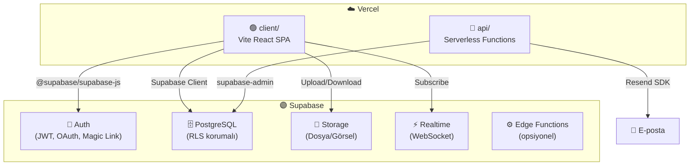
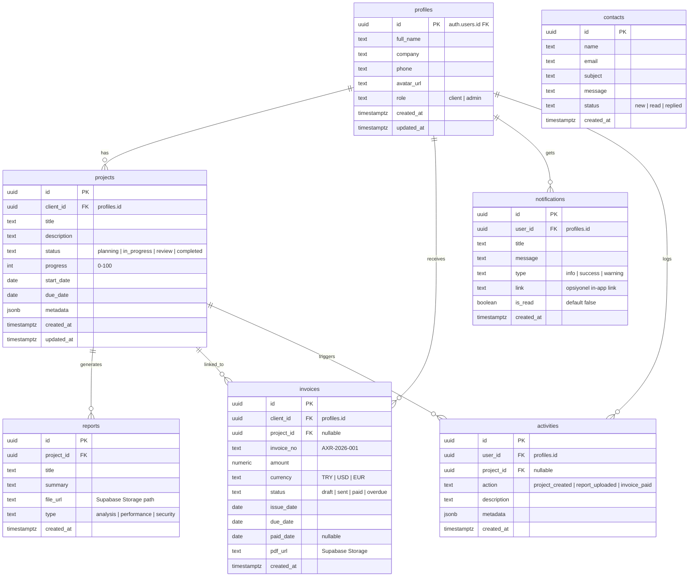

# Axiar Intelligence — Full-Stack Dosya Hiyerarşisi v3

Monorepo · Frontend (Vite + React 18) · Backend (Supabase + Vercel Serverless) · Vercel Deploy

---

## Mimari Genel Bakış



---

## Tam Dosya Ağacı

```
axiarintelligence/
│
│── 📄 vercel.json                          # Build, rewrite, header, env config
│── 📄 package.json                         # Root workspace (workspaces: [client, api])
│── 📄 .gitignore
│── 📄 .env.example                         # Tüm env şablonu
│── 📄 .env.local                           # Yerel geliştirme (gitignore'd)
│── 📄 README.md
│── 📄 LICENSE
│
│
│ ══════════════════════════════════════════════════════════
│  🗄️  SUPABASE — Veritabanı Şeması & Konfigürasyon
│ ══════════════════════════════════════════════════════════
│
├── supabase/
│   ├── config.toml                         # Supabase CLI proje ayarları
│   ├── seed.sql                            # Başlangıç test verisi
│   └── migrations/
│       ├── 00001_create_profiles.sql        # Kullanıcı profil tablosu + RLS
│       ├── 00002_create_projects.sql        # Projeler tablosu + RLS
│       ├── 00003_create_reports.sql         # Raporlar tablosu + RLS
│       ├── 00004_create_invoices.sql        # Faturalar tablosu + RLS
│       ├── 00005_create_activities.sql      # Aktivite log tablosu
│       ├── 00006_create_notifications.sql   # Bildirimler tablosu
│       ├── 00007_create_contacts.sql        # İletişim form kayıtları
│       └── 00008_create_storage_buckets.sql # Storage bucket politikaları
│
│
│ ══════════════════════════════════════════════════════════
│  🔵  API — Vercel Serverless Functions
│ ══════════════════════════════════════════════════════════
│
├── api/
│   │
│   ├── contact.js                          # POST → İletişim formu → Resend e-posta + DB kayıt
│   │
│   ├── webhooks/
│   │   └── supabase-auth.js                # Supabase Auth webhook (yeni kayıt → profil oluştur)
│   │
│   ├── admin/
│   │   ├── users.js                        # GET → Admin: tüm kullanıcılar listesi
│   │   ├── projects.js                     # POST/PUT → Admin: proje oluştur/güncelle
│   │   ├── invoices.js                     # POST → Admin: fatura oluştur
│   │   └── reports.js                      # POST → Admin: rapor yükle
│   │
│   ├── cron/
│   │   └── invoice-reminder.js             # Cron → Vadesi gelen fatura hatırlatma e-postası
│   │
│   └── _lib/                               # Paylaşılan backend yardımcıları (route değil)
│       ├── supabase-admin.js               # Supabase service_role client (server-side)
│       ├── supabase.js                     # Supabase anon client (client-side uyumlu)
│       ├── middleware.js                   # withAuth, withAdmin, withRateLimit, withCors
│       ├── mailer.js                       # Resend e-posta gönderimi
│       ├── errors.js                       # Standart hata response helper
│       └── validators.js                   # Zod input validasyon şemaları
│
│
│ ══════════════════════════════════════════════════════════
│  🟢  CLIENT — Vite + React 18 Frontend
│ ══════════════════════════════════════════════════════════
│
├── client/
│   │
│   ├── 📄 package.json
│   ├── 📄 vite.config.js                   # Vite + @tailwindcss/vite + alias + proxy
│   ├── 📄 eslint.config.js
│   ├── 📄 index.html                       # Entry (meta, Google Fonts Inter, title)
│   │
│   ├── public/
│   │   ├── favicon.svg
│   │   ├── apple-touch-icon.png            # iOS home screen ikonu
│   │   ├── og-image.png                    # Open Graph paylaşım görseli
│   │   ├── robots.txt
│   │   ├── sitemap.xml
│   │   └── _redirects                      # Netlify fallback (ek uyumluluk)
│   │
│   └── src/
│       │
│       │ ── 🎨 assets/
│       │   ├── logo-axiar.svg
│       │   ├── logo-axiar-icon.svg
│       │   ├── logo-axiar-white.svg        # Beyaz versiyon (koyu bg için)
│       │   ├── fonts/
│       │   │   └── Inter-Variable.woff2    # Self-hosted Inter (opsiyonel)
│       │   ├── images/
│       │   │   ├── cyberguard-mockup.webp
│       │   │   ├── metazon-mockup.webp
│       │   │   ├── hero-bg-fallback.webp
│       │   │   └── portal-preview.webp     # Portal ekran görüntüsü (landing'de)
│       │   └── icons/
│       │       ├── tech-react.svg          # Marquee teknoloji ikonları
│       │       ├── tech-vite.svg
│       │       ├── tech-tailwind.svg
│       │       ├── tech-python.svg
│       │       ├── tech-node.svg
│       │       ├── tech-supabase.svg
│       │       ├── tech-vercel.svg
│       │       └── tech-openai.svg
│       │
│       │ ── 🧩 components/
│       │   │
│       │   ├── layout/                     # ─── İskelet / yapısal
│       │   │   ├── Navbar.jsx              #   Glassmorphism sticky menü
│       │   │   ├── NavLinks.jsx            #   Desktop nav link grubu
│       │   │   ├── MobileMenu.jsx          #   Hamburger slide-in menü
│       │   │   ├── Footer.jsx              #   Alt bilgi, linkler, sosyal
│       │   │   ├── FooterColumn.jsx        #   Footer link kolonu
│       │   │   ├── SectionWrapper.jsx      #   Ortak section padding/max-width
│       │   │   ├── SectionHeading.jsx      #   Bölüm başlığı (badge + h2 + subtitle)
│       │   │   ├── PageTransition.jsx      #   AnimatePresence route geçiş wrapper
│       │   │   └── ScrollToTop.jsx         #   Route değiştiğinde sayfa başına scroll
│       │   │
│       │   ├── ui/                         # ─── Atomik yeniden kullanılabilir
│       │   │   ├── Button.jsx              #   Primary/Secondary/Ghost/Danger/Icon
│       │   │   ├── IconButton.jsx          #   Sadece ikon buton
│       │   │   ├── Card.jsx                #   Glassmorphism kart (glow border)
│       │   │   ├── GlassCard.jsx           #   Daha yoğun blur efektli kart
│       │   │   ├── Badge.jsx               #   Durum etiketi (success/warning/info/danger)
│       │   │   ├── Input.jsx               #   Text / Email / Password
│       │   │   ├── Textarea.jsx            #   Çok satırlı input
│       │   │   ├── Select.jsx              #   Dropdown select
│       │   │   ├── Checkbox.jsx            #   Onay kutusu
│       │   │   ├── Toggle.jsx              #   Switch toggle
│       │   │   ├── Modal.jsx               #   Overlay dialog
│       │   │   ├── ConfirmDialog.jsx       #   Silme/işlem onay dialogu
│       │   │   ├── Dropdown.jsx            #   Açılır menü
│       │   │   ├── Tabs.jsx                #   Tab navigasyonu
│       │   │   ├── Spinner.jsx             #   Loading animasyonu
│       │   │   ├── Skeleton.jsx            #   İçerik placeholder
│       │   │   ├── ProgressBar.jsx         #   İlerleme çubuğu
│       │   │   ├── GlowLine.jsx            #   Dekoratif neon çizgi
│       │   │   ├── Tooltip.jsx             #   Hover bilgi baloncuğu
│       │   │   ├── Avatar.jsx              #   Profil resmi / baş harf
│       │   │   ├── AvatarGroup.jsx         #   Birden çok avatar (overlap)
│       │   │   ├── EmptyState.jsx          #   "Veri yok" placeholder
│       │   │   ├── StatusDot.jsx           #   Küçük renkli durum noktası
│       │   │   ├── DataTable.jsx           #   Sıralanabilir/filtrelenebilir tablo
│       │   │   ├── Pagination.jsx          #   Sayfa numaralama
│       │   │   └── FileUpload.jsx          #   Drag & drop dosya yükleme
│       │   │
│       │   ├── landing/                    # ─── Landing page bileşenleri
│       │   │   ├── Hero.jsx                #   Başlık + CTA + particle canvas
│       │   │   ├── HeroButtons.jsx         #   CTA buton grubu
│       │   │   ├── ParticleCanvas.jsx      #   Canvas siber ağ animasyonu
│       │   │   ├── Manifesto.jsx           #   Vizyon/misyon metin bloğu
│       │   │   ├── ManifestoFeature.jsx    #   Tek özellik satırı (ikon + metin)
│       │   │   ├── EcosystemGrid.jsx       #   4-kart hizmet alanları
│       │   │   ├── EcosystemCard.jsx       #   Tek ekosistem kartı
│       │   │   ├── Showcase.jsx            #   Ürün tanıtım bölümü
│       │   │   ├── ShowcaseCard.jsx         #   Tek ürün kartı
│       │   │   ├── TechMarquee.jsx         #   Sonsuz kayan teknoloji şeridi
│       │   │   ├── TechIcon.jsx            #   Tek teknoloji ikonu
│       │   │   ├── StatsCounter.jsx        #   Animasyonlu sayısal istatistikler
│       │   │   ├── StatItem.jsx            #   Tek istatistik öğesi
│       │   │   ├── Testimonials.jsx        #   Müşteri yorumları / güven
│       │   │   ├── TestimonialCard.jsx     #   Tek yorum kartı
│       │   │   ├── ContactSection.jsx      #   Form + iletişim bilgileri wrapper
│       │   │   ├── ContactForm.jsx         #   Form mantığı
│       │   │   ├── ContactInfo.jsx         #   Adres, tel, e-posta kartı
│       │   │   ├── CTABanner.jsx           #   Son çağrı aksiyonu bandı
│       │   │   └── FloatingElements.jsx    #   Dekoratif uçuşan geometrik şekiller
│       │   │
│       │   └── portal/                     # ─── Portal bileşenleri
│       │       ├── Sidebar.jsx             #   Sol dikey navigasyon
│       │       ├── SidebarLink.jsx         #   Tek menü öğesi
│       │       ├── SidebarUserCard.jsx     #   Alt köşe kullanıcı bilgi kartı
│       │       ├── PortalTopbar.jsx        #   Üst bar (breadcrumb, bildirim, kullanıcı)
│       │       ├── Breadcrumb.jsx          #   Sayfa yol izleme
│       │       ├── StatWidget.jsx          #   İstatistik kartı (sayı + trend)
│       │       ├── StatWidgetGrid.jsx      #   4'lü stat grid
│       │       ├── ProjectCard.jsx         #   Proje durum kartı
│       │       ├── ProjectStatusBadge.jsx  #   Proje durum etiketi
│       │       ├── ProjectTimeline.jsx     #   Proje aşama zaman çizelgesi
│       │       ├── ReportTable.jsx         #   Rapor veri tablosu
│       │       ├── ReportPreview.jsx       #   Rapor önizleme modalı
│       │       ├── InvoiceRow.jsx          #   Fatura satır bileşeni
│       │       ├── InvoiceStatusBadge.jsx  #   Ödeme durumu etiketi
│       │       ├── InvoiceSummary.jsx      #   Toplam/ödenen/kalan özet kartı
│       │       ├── ActivityFeed.jsx        #   Son aktiviteler listesi
│       │       ├── ActivityItem.jsx        #   Tek aktivite satırı
│       │       ├── QuickActions.jsx        #   Hızlı işlem butonları
│       │       ├── NotificationBell.jsx    #   Bildirim dropdown
│       │       ├── NotificationItem.jsx    #   Tek bildirim öğesi
│       │       ├── WelcomeBanner.jsx       #   Dashboard hoş geldin kartı
│       │       ├── FileManager.jsx         #   Supabase Storage dosya listesi
│       │       ├── FileCard.jsx            #   Tek dosya kartı
│       │       └── ProfileForm.jsx         #   Profil düzenleme formu
│       │
│       │ ── 🔐 context/
│       │   └── AuthContext.jsx             # Supabase Auth provider + useAuth hook
│       │
│       │ ── 🪝 hooks/
│       │   ├── useScrollReveal.js          # IntersectionObserver reveal
│       │   ├── useMediaQuery.js            # Responsive breakpoint
│       │   ├── useClickOutside.js          # Dropdown/modal dış tıklama
│       │   ├── useLocalStorage.js          # localStorage wrapper
│       │   ├── useDebounce.js              # Input debounce
│       │   ├── useSupabaseQuery.js         # Supabase veri çekme hook (loading/error)
│       │   ├── useRealtime.js              # Supabase Realtime subscription hook
│       │   ├── useFileUpload.js            # Supabase Storage upload hook
│       │   └── useCountUp.js              # Sayı animasyonu hook (stats için)
│       │
│       │ ── 📐 layouts/
│       │   ├── MainLayout.jsx              # Landing: Navbar + Outlet + Footer
│       │   ├── PortalLayout.jsx            # Portal: Sidebar + Topbar + Outlet
│       │   ├── AuthLayout.jsx              # Login/Register: minimal, centered layout
│       │   └── AuthGuard.jsx               # Token kontrol → Login'e yönlendir
│       │
│       │ ── 📄 pages/
│       │   ├── Home.jsx                    # Landing tüm section'lar
│       │   ├── NotFound.jsx                # 404 sayfası
│       │   ├── PrivacyPolicy.jsx           # Gizlilik politikası
│       │   ├── TermsOfService.jsx          # Kullanım koşulları
│       │   │
│       │   └── portal/
│       │       ├── Login.jsx               # E-posta + şifre + OAuth
│       │       ├── Register.jsx            # Kayıt formu
│       │       ├── ForgotPassword.jsx      # Şifre sıfırlama talebi
│       │       ├── ResetPassword.jsx       # Yeni şifre belirleme
│       │       ├── VerifyEmail.jsx         # E-posta doğrulama
│       │       ├── Dashboard.jsx           # Genel bakış
│       │       ├── Projects.jsx            # Proje listesi
│       │       ├── ProjectDetail.jsx       # Tek proje detayı
│       │       ├── Reports.jsx             # Rapor listesi
│       │       ├── ReportDetail.jsx        # Tek rapor detayı
│       │       ├── Invoices.jsx            # Fatura listesi
│       │       ├── InvoiceDetail.jsx       # Tek fatura detayı
│       │       ├── Files.jsx               # Dosya yönetimi (Supabase Storage)
│       │       ├── Notifications.jsx       # Tüm bildirimler sayfası
│       │       └── Settings.jsx            # Profil & hesap ayarları
│       │
│       │ ── 🌐 services/
│       │   ├── supabase.js                 # Supabase client (anon key)
│       │   ├── authService.js              # signIn, signUp, signOut, resetPassword, updateUser
│       │   ├── projectService.js           # Projeler CRUD (Supabase client)
│       │   ├── reportService.js            # Raporlar okuma
│       │   ├── invoiceService.js           # Faturalar okuma
│       │   ├── notificationService.js      # Bildirim CRUD + okundu işaretle
│       │   ├── fileService.js              # Supabase Storage upload/download/delete
│       │   ├── activityService.js          # Aktivite log okuma
│       │   ├── profileService.js           # Profil güncelleme, avatar upload
│       │   └── contactService.js           # İletişim formu gönder (→ /api/contact)
│       │
│       │ ── 📦 store/
│       │   ├── usePortalStore.js            # Sidebar, aktif menü, mobile toggle
│       │   └── useThemeStore.js             # Tema tercihi (dark/system)
│       │
│       │ ── 🛠️ utils/
│       │   ├── constants.js                # Nav, ekosistem, teknoloji verileri
│       │   ├── helpers.js                  # Tarih format, para format, slug, truncate
│       │   ├── motion.js                   # Framer Motion variant presetleri
│       │   ├── validators.js               # Zod form validasyon şemaları
│       │   └── cn.js                       # className merge utility (clsx + twMerge)
│       │
│       ├── App.jsx                         # Router + AnimatePresence + Toast
│       ├── index.css                       # @import "tailwindcss" + @theme + globals
│       └── main.jsx                        # createRoot + AuthProvider + App
│
│
│ ══════════════════════════════════════════════════════════
│  📘 DOCS — Proje belgeleri
│ ══════════════════════════════════════════════════════════
│
└── docs/
    ├── API.md                              # API endpoint referansı
    ├── DATABASE.md                         # Supabase tablo şemaları & RLS kuralları
    ├── DEPLOYMENT.md                       # Vercel + Supabase deploy adımları
    └── ARCHITECTURE.md                     # Mimari kararlar & akışlar
```

---

## Supabase Veritabanı Şeması



---

## Vercel + Supabase Deploy Yapısı

```json
// vercel.json
{
  "buildCommand": "cd client && npm install && npm run build",
  "outputDirectory": "client/dist",
  "installCommand": "npm install",
  "rewrites": [
    { "source": "/api/(.*)", "destination": "/api/$1" },
    { "source": "/(.*)",     "destination": "/index.html" }
  ],
  "headers": [
    {
      "source": "/api/(.*)",
      "headers": [
        { "key": "Access-Control-Allow-Credentials", "value": "true" },
        { "key": "Cache-Control", "value": "no-store" }
      ]
    },
    {
      "source": "/assets/(.*)",
      "headers": [
        { "key": "Cache-Control", "value": "public, max-age=31536000, immutable" }
      ]
    }
  ],
  "crons": [
    { "path": "/api/cron/invoice-reminder", "schedule": "0 9 * * *" }
  ]
}
```

**Vercel env değişkenleri:**

| Değişken | Açıklama |
|---|---|
| `VITE_SUPABASE_URL` | Supabase proje URL'i |
| `VITE_SUPABASE_ANON_KEY` | Supabase anon/public key |
| `SUPABASE_SERVICE_ROLE_KEY` | Server-side admin key (sadece api/) |
| `RESEND_API_KEY` | E-posta gönderim key |
| `SITE_URL` | `https://axiar.io` |

---

## Dosya Sayısı Özeti

| Katman | Dosya | Klasör |
|---|---|---|
| Root (config) | 6 | — |
| Supabase (migrations) | 10 | 2 |
| API (Serverless) | 14 | 5 |
| Client (Frontend) | 120+ | 20 |
| Docs | 4 | 1 |
| **Toplam** | **~155** | **28** |
